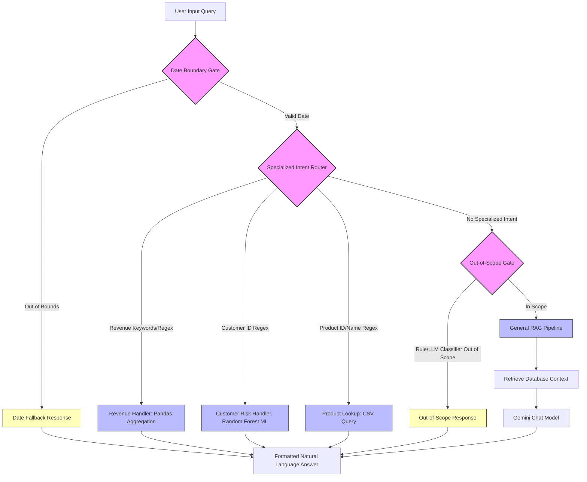

# 🏛️ Architectural Report: Deterministic Intent-Routed RAG Architecture
## Shift from "Pure LLM" to a Hybrid Intelligent Assistant

This document outlines the architectural transition of the **InsightPulse Assistant** from a basic, retrieval-heavy RAG chatbot to a specialized, intent-routed hybrid intelligence system. By combining deterministic data operations, machine learning classification, and LLM-based reasoning, the assistant delivers high-reliability responses, eliminates mathematical hallucinations, and protects operational databases from out-of-scope pollution.

---

## 🌐 The Shift: Pure RAG vs. Intent-Routed Hybrid

In a standard RAG configuration (Week 2), all queries follow a single path: retrieve semantic chunks from the database, concatenate them into a prompt context, and ask the LLM to synthesize the final response. While effective for open-ended queries, this approach suffers from significant limitations:

1. **Mathematical Inaccuracy**: LLMs struggle with precise arithmetic (e.g., calculating annual revenues or monthly sales margins over thousands of records) and can hallucinate numeric values.
2. **Token Inefficiency**: Retrieving thousands of rows of transaction data to answer a simple financial query consumes massive context windows and incurs high API costs.
3. **Lack of Predictive Capability**: A standard RAG pipeline cannot run statistical calculations, scale inputs, or generate machine learning inferences (e.g., churn probabilities) on the fly.
4. **Scope and Hallucination Risks**: Users can ask unrelated questions (e.g., cooking recipes), leading to confusing or off-brand responses, or ask about timeframes for which no historical data exists.

The new **Intent-Routed Hybrid Architecture** resolves these challenges by introducing a pre-processing routing layer that triages queries before they touch the general LLM.

---

## 🗺️ Architectural Workflow

The following diagram illustrates how an incoming user query traverses the different layers of the routing system:

---

## ⚙️ Core Components & Processing Layers

### 1. The Date Boundary Gate
Before any intent classification occurs, the query passes through the `check_date_out_of_bounds` handler.
- **Purpose**: Prevent hallucinations regarding timeframes not supported by the system.
- **Logic**: Inspects the query for 4-digit years or relative timeframe keywords. If it detects requests for periods outside **January 2023 – December 2024**, it intercepts the query immediately and returns a friendly warning response, bypassing downstream models entirely.

### 2. The Specialized Intent Router
Queries within the valid timeframe are checked against three deterministic data handlers using refined regular expressions and keyword matching:

*   **Intent 1: Revenue Summary (Pandas Aggregation)**:
    *   *Trigger*: Phrasing containing `"revenue"`, `"sales"`, `"make"`, `"earn"`, or month/year indicators.
    *   *Execution*: Automatically extracts month, year, and category entities. Filters the `transactions.csv.xlsx` DataFrame directly via Pandas to calculate total delivered revenue, items sold, transaction counts, and average order values.
    *   *Benefit*: Provides 100% accurate, up-to-the-cent financial data.

*   **Intent 2: Customer Risk (Random Forest ML inference)**:
    *   *Trigger*: Patterns matching customer IDs (e.g., `CUST00123`, case-insensitive) combined with risk/churn keywords.
    *   *Execution*: Loads the serialized `churn_model.joblib` (StandardScaler, LabelEncoder, and RandomForestClassifier). It extracts the customer's record, calculates features (Recency, Frequency, Monetary Value, Age, Support Tickets), scales inputs, and runs `.predict_proba()` to retrieve a real probability score.
    *   *Benefit*: Blends statistical ML inference with dynamic profile lookups.

*   **Intent 3: Product Lookup (CSV Direct Query)**:
    *   *Trigger*: Exact product IDs (e.g., `PROD001`) or key product names (e.g., `"Wireless Earbuds"`, `"Air Fryer"`).
    *   *Execution*: Queries the `products.csv` database to retrieve exact metadata (Supplier, Base Price, Cost Price, Rating, Stock Level). It calculates the profit margin dynamically:
        $$\text{Profit Margin} = \frac{\text{Base Price} - \text{Cost Price}}{\text{Base Price}} \times 100$$
    *   *Benefit*: Provides instant inventory status and margin data without consuming LLM reasoning tokens.

### 3. The Out-of-Scope Gate
If a query does not match any specialized intent, it is evaluated by the Out-of-Scope handler to verify relevance.
- **Purpose**: Prevent off-brand interactions and reduce unnecessary LLM API calls.
- **Logic**: Performs a rapid keyword scan. If inconclusive, it calls the Gemini API using the new `google.genai` SDK with a zero-temperature classification prompt to label the query as `IN_SCOPE` or `OUT_SCOPE`.
- **Action**: If labeled `OUT_SCOPE`, it returns a generic, friendly redirection response, blocking it from executing RAG.

### 4. General RAG Pipeline (Fallback)
If the query is marked `IN_SCOPE` but matches no specialized intent (e.g., "Which customer segments should we target?"), it falls back to the general RAG pipeline.
- **Logic**: Scans the database using keyword matching to build a rich contextual document. If a Gemini API Key is provided, it calls `ConversationalRetrievalChain` with LangChain's conversational buffer memory to answer. If offline, it routes to a custom rules-engine fallback responder.

---

## 📈 Key Accomplishments & Improvements

1. **Precision Calculations**: Math queries are calculated programmatically rather than guessed by the generative model.
2. **Zero Warning Logs**: Upgraded to the modern `google.genai` SDK, eliminating deprecated library logs.
3. **Case-Insensitive Robustness**: Regex captures inputs like `cust00123`, `CUST12345`, or `prod012` flawlessy.
4. **Actionable ML Integration**: Integrated a week-trained Random Forest model to offer live probability scores for customer attrition, rather than static classifications.
5. **Context-Aware Follow-Up Handling**: Resolved a routing conflict where pronoun-heavy comparison follow-up queries (e.g., *'And how does that compare to the month before?'*) were falsely flagged as out-of-scope by the routing engine, ensuring seamless conversation memory traversal.
